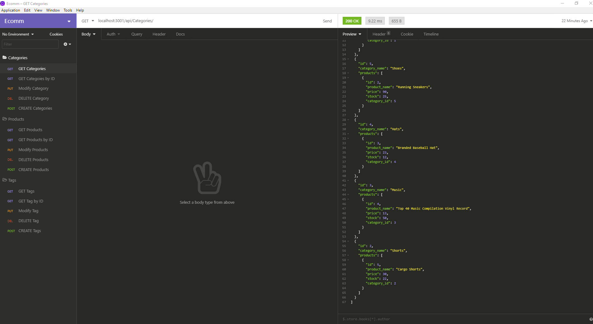

# E-commerce Back End

AS A manager at an internet retail company
I WANT a back end for my e-commerce website that uses the latest technologies
SO THAT my company can compete with other e-commerce companies

The application gives yout the following options:
* GIVEN a functional Express.js API
* WHEN I add my database name, MySQL username, and MySQL password to an environment variable file
* THEN I am able to connect to a database using Sequelize
* WHEN I enter schema and seed commands
* THEN a development database is created and is seeded with test data
* WHEN I enter the command to invoke the application
* THEN my server is started and the Sequelize models are synced to the MySQL database
* WHEN I open API GET routes in Insomnia for categories, products, or tags
* THEN the data for each of these routes is displayed in a formatted JSON
* WHEN I test API POST, PUT, and DELETE routes in Insomnia
* THEN I am able to successfully create, update, and delete data in my database

## Installation
---
1. Open Terminal
2. npm install for Dependencies
3. Create file call .env and use these variables with your personal mysql crediticals, database name, and Node Enviorment.
    * DB_USER = ''
    * DB_PW = ''
    * MYSQL_HOST = ''
    * MYSQL_PORT = ''
    * DB_NAME = ''
    * NODE_ENV = ''
4. In Terminal
   (Run) `mysql -u root -p` type sql password when prompted
5. Type `source db/schema.sql` to source your database
6. Quit mysql and type `npm run seed` to seed database.

## Usage
---
1. Run `npm start` in Terminal to start the server
2. Run Insomina and Create and enviroment where you hosted your server.
3. There are three modules to use.

    

## Tool & Resources
---
* [Node.js](https://nodejs.org/en/) - JavaScript runtime environment
* [MySQLWorkbench](https://www.mysql.com/products/workbench/) - Visual database design tool
    ### Dependencies
    ---
    * [Express](https://www.npmjs.com/package/express) - For routing.
    * [Sequelize](https://www.npmjs.com/package/sequelize) - Sequelize is a promise-based Node.js ORM for Postgres, MySQL, MariaDB, SQLite and Microsoft SQL Server
    * [dotenv](https://www.npmjs.com/package/dotenv) - Dotenv is a zero-dependency module that loads environment variables from a .env file into process.env
    * [mysql2](https://www.npmjs.com/package/mysql2) - Used to connect to the MySQL database and perform queries

* [RepoLink] https://github.com/Ceven8498/Ecomm

## Video Tutorial

* [VideoLink]https://youtu.be/ciPs8iDf5ws